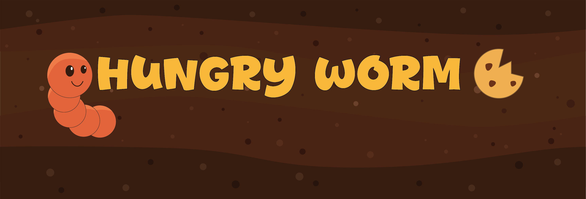

  

Hungry Worm is an endless runner created during the Brackeys gameJam in 2025 where you control a nimble worm trying to travel as far as possible through a winding tunnel.
Eat biscuits to grow your score (and maybe your ego), but be careful: the farther you go, the harder it gets.

##

- 🎮 Gameplay
  - Objective: Travel as far as you can while avoiding the walls.
  - Scoring: Each biscuit you eat increases your score and distance multiplier.
  - Challenge: The game becomes progressively faster and more difficult as your distance increases.
  - Procedural Generation: The tunnel layout is procedurally generated, making every run unique.

- 🧠 Features
  - Built entirely in C# using Unity
  - Procedural map generation for infinite replayability
  - All assets created by me
  - All audio created by Vitor Terra
  - Increasing difficulty based on distance traveled

  

- 🕹️ Controls
  - Space Bar or left mouse click to change the worm direction
  

- 🧩 Tech Stack
  - Engine: Unity
  - Language: C#
  - WebGL

